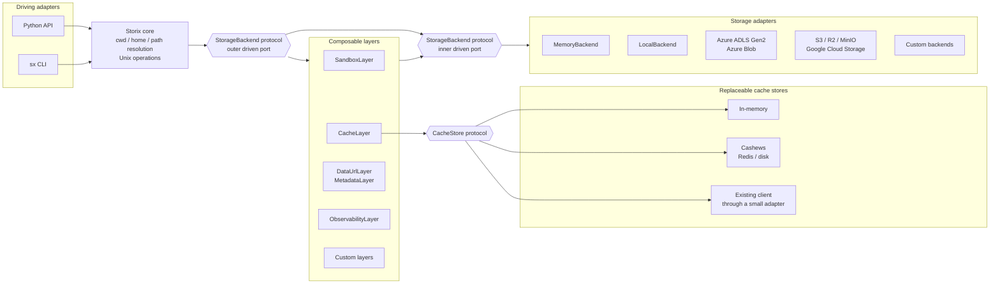

# One Stream, Three Backends: Streaming FFmpeg to Local, Azure, and R2 with Python

*Why Storix uses native Python streams, provider-agnostic storage sessions, and composable layers instead of provider-specific upload code.*

A process is already producing data.

It might be FFmpeg generating media, a compressor writing an archive, an HTTP request delivering an upload, a database exporting records, or an inference pipeline producing artifacts.

The storage destination should not determine how that producer works.

A common workflow looks like this:

```text
producer
-> write a temporary file
-> reopen the file
-> upload it through a provider-specific SDK
-> delete the temporary file
```

That works, but it spreads storage concerns into the producer and creates an intermediate file that may not need to exist.

I wanted the flow to look like this instead:

```text
producer
-> Iterable[bytes] or AsyncIterable[bytes]
-> Storix
-> configured storage backend
```

In this demo, FFmpeg generates a fragmented MP4 through stdout. Python exposes that output as an `AsyncIterator[bytes]`, and Storix writes the same stream to:

- A local directory
- Azure Blob Storage
- Cloudflare R2 through its S3-compatible API

The Python code and logical destination path stay fixed. Only the selected Storix configuration changes.

<figure class="storix-demo">
  <video
    controls
    playsinline
    preload="metadata"
    poster="https://media.mghalix.com/storix/one-stream-three-backends-poster.webp"
    aria-label="Storix streaming FFmpeg output to local storage, Azure Blob Storage, and Cloudflare R2"
  >
    <source
      src="https://media.mghalix.com/storix/one-stream-three-backends.mp4"
      type="video/mp4"
    >

    Your browser does not support embedded video.
    <a href="https://media.mghalix.com/storix/one-stream-three-backends.mp4">
      Open the demo video.
    </a>
  </video>

  <figcaption>
    FFmpeg stdout streamed to local storage, Azure Blob Storage, and
    Cloudflare R2. The producer and logical path do not change.
  </figcaption>
</figure>

[:fontawesome-brands-youtube: Watch on YouTube](https://youtu.be/l9SpFWYtRR8)

[:fontawesome-brands-github: View the complete runnable demo](https://github.com/mghalix/storix/tree/main/samples/showcase/one-stream-three-backends)

> The demo uses three destinations to keep the sequence short and readable. Storix also supports Azure Data Lake Gen2, Amazon S3 and compatible stores such as MinIO, and Google Cloud Storage.

## The core write

This is the part of the demo that matters:

```python
from storix.aio import get_storage


async with get_storage() as fs:
    await fs.mkdir("/launch", parents=True)
    await fs.echo(
        ffmpeg_stream(),
        "/launch/one-stream-three-backends.mp4",
        chunk_size=4 * 1024 * 1024,
    )
```

There is no Azure SDK, S3 SDK, or local filesystem branch in the application logic.

There is also no application-managed temporary video file.

FFmpeg produces chunks. Storix consumes them.

## A producer should just be Python

Developer experience is one of the main reasons I built Storix around native Python types.

You should not have to convert data into a library-specific upload object before it can be stored.

`echo()` accepts the values Python developers already work with:

- Text and binary values such as `str`, `bytes`, `bytearray`, and other buffer-compatible objects
- Open text or binary streams such as `IO[str]` and `IO[bytes]`, including regular `open(...)` file objects
- `Iterable[str | Buffer]` and `Iterable[bytes | Buffer]`
- `AsyncIterable[str | Buffer]` and `AsyncIterable[bytes | Buffer]` through `storix.aio`

The public contract is built from standard Python `IO`, `Iterable`, `AsyncIterable`, and buffer-protocol types rather than a Storix-specific stream class.

The FFmpeg producer is therefore an ordinary async generator:

```python
import asyncio
import contextlib

from collections.abc import AsyncIterator


async def ffmpeg_stream() -> AsyncIterator[bytes]:
    process = await asyncio.create_subprocess_exec(
        *command,
        stdout=asyncio.subprocess.PIPE,
        stderr=asyncio.subprocess.PIPE,
    )

    assert process.stdout is not None
    assert process.stderr is not None

    # Drain stderr while stdout is being consumed so FFmpeg cannot block on a
    # full error pipe. The complete sample also reports FFmpeg failures.
    stderr_task = asyncio.create_task(process.stderr.read())

    try:
        while chunk := await process.stdout.read(64 * 1024):
            yield chunk

        return_code = await process.wait()
        stderr = await stderr_task

        if return_code != 0:
            detail = stderr.decode("utf-8", errors="replace").strip()
            raise RuntimeError(detail or f"FFmpeg exited with status {return_code}")
    finally:
        if process.returncode is None:
            process.kill()
            await process.wait()

        if not stderr_task.done():
            stderr_task.cancel()

        with contextlib.suppress(asyncio.CancelledError):
            await stderr_task
```

Nothing in this function knows that Storix exists.

It could feed those chunks into an HTTP response, a message broker, a hashing pipeline, a parser, or any other consumer that accepts an async iterable.

Storix is only the destination.

See the [`echo()` reference](https://storix.mghalix.com/reference/storix/#echo) for the complete input contract.

## Regular Python file objects work too

Not every workflow begins with a subprocess.

A regular file opened through Python can be passed directly:

```python
from storix.aio import get_storage


async with get_storage("local", base="./data") as fs:
    await fs.mkdir("/reports", parents=True)

    with open("report.parquet", "rb") as source:
        await fs.echo(source, "/reports/report.parquet")
```

Text files work the same way:

```python
async with get_storage() as fs:
    await fs.mkdir("/events", parents=True)

    with open("events.ndjson", encoding="utf-8") as source:
        await fs.echo(source, "/events/events.ndjson")
```

You can also produce chunks yourself:

```python
from collections.abc import AsyncIterator


async def generate_export() -> AsyncIterator[bytes]:
    async for row in database_rows():
        yield encode_row(row)


async with get_storage() as fs:
    await fs.mkdir("/exports", parents=True)
    await fs.echo(
        generate_export(),
        "/exports/customers.ndjson",
    )
```

The storage API does not force the producer to become storage-aware.

## Streaming works in both directions

Writing is only half of the flow.

Storix can read files incrementally with `stream()`.

The synchronous API produces a regular iterator:

```python
from storix import get_storage


with get_storage("local", base="./data") as fs:
    for chunk in fs.stream("/videos/source.mp4"):
        downstream.send(chunk)
```

The asynchronous API produces an async iterator:

```python
from storix.aio import get_storage


async with get_storage() as fs:
    async for chunk in fs.stream(
        "/videos/source.mp4",
        chunk_size=64 * 1024,
    ):
        await downstream.send(chunk)
```

The downstream consumer might be an HTTP response, decompressor, parser, media processor, hashing pipeline, inference component, or another storage destination.

For small, known-size files, `cat()` returns the complete contents as `bytes`. For larger workloads, `stream()` lets the application process data incrementally instead of materializing the complete object first.

For downloads into a seekable file, Storix 0.5.0 can go further than an ordered stream. `download()` may fetch several byte ranges of one large object concurrently and write each range at its destination offset. `stream()` remains the ordered incremental API for arbitrary consumers.

In one measured 200 MiB Azure download over a home connection, eight ranges reduced wall time from 61.53 seconds to 25.51 seconds, with peak RSS of 173 MB. This is one measurement, not a universal speed guarantee. Each range is a separate request, so the throughput improvement trades against transaction count. Use `ranges=1`, or `STORIX_MAX_TRANSFER_RANGES=1`, to keep every download on one stream.

See:

- [`stream()` reference](https://storix.mghalix.com/reference/storix/#stream)
- [Tune transfer memory and throughput](https://storix.mghalix.com/recipes/transfers/)

## Provider selection belongs at the composition boundary

The demo uses `get_storage()` without naming a provider in the Python code:

```python
from storix.aio import get_storage


async with get_storage() as fs:
    ...
```

The active provider can come from environment configuration:

```bash
STORIX_PROVIDER=local uv run python demo.py
STORIX_PROVIDER=azure uv run python demo.py
STORIX_PROVIDER=s3 uv run python demo.py
```

Provider-specific settings remain namespaced.

For Azure:

```dotenv
STORIX_PROVIDER=azure
STORIX_AZURE_CONTAINER=storix-demo
STORIX_AZURE_ACCOUNT_NAME=my-account
STORIX_AZURE_CREDENTIAL=...

# Optional. The default is auto.
STORIX_AZURE_KIND=blob
```

With `kind="auto"`, Storix checks whether the account has hierarchical namespaces enabled and selects either the ADLS Gen2 backend or the Blob backend. Explicit `blob` or `adls` selection skips that detection when the intended surface is already known or account-level detection is unavailable.

For Cloudflare R2:

```dotenv
STORIX_PROVIDER=s3
STORIX_S3_BUCKET=storix-demo
STORIX_S3_REGION=auto
STORIX_S3_ENDPOINT=https://<account-id>.r2.cloudflarestorage.com
STORIX_S3_ACCESS_KEY_ID=...
STORIX_S3_SECRET_ACCESS_KEY=...
```

R2 uses Storix's S3 backend because it exposes an S3-compatible API. Cloudflare's SDK guidance uses `region_name="auto"`; the value is required by AWS SDK conventions but is not used as an R2 region.

See:

- [Configure Storix from settings](https://storix.mghalix.com/recipes/settings/)
- [Profiles and stages](https://storix.mghalix.com/guide/profiles/)
- [Storix backends](https://storix.mghalix.com/guide/backends/)
- [Cloudflare R2 S3 SDK configuration](https://developers.cloudflare.com/r2/get-started/s3/#3-use-an-aws-sdk)

### Name a connection once, then select it by name

Storix 0.5.0 gives that composition boundary a name.

A *profile* is one provider plus its settings. A *stage* overlays what differs between deployments:

```toml
# storix.toml, or ~/.config/storix/config.toml
[profiles.ingest]
provider = "azure"
container = "raw"
default_environment = "dev"

[profiles.ingest.environments.dev]
account_name = "acmedevstorage"
credential = "env:ACME_DEV_CREDENTIAL"

[profiles.ingest.environments.prod]
account_name = "acmeprdstorage"
credential = "env:ACME_PRD_CREDENTIAL"

[profiles.archive]
provider = "s3"
bucket = "archive"
region = "auto"
endpoint = "https://<account-id>.r2.cloudflarestorage.com"
```

```python
fs = get_storage(
    profile="ingest",
    environment=os.environ["STAGE"],
)
```

```bash
sx --profile ingest --env prod ls /
```

Non-secret coordinates can live in the file. A credential can be named without being stored there:

```toml
credential = "env:ACME_PRD_CREDENTIAL"
```

Each stage can name its own credential variable, so a deployment only needs to expose the credential for the stage it runs. An unset variable fails during configuration loading instead of falling back to another stage.

A pinned profile and `STORIX_PROFILE` steer `sx`, deliberately not a plain `get_storage()` call. The library selects a profile only when the call asks for one, so personal CLI configuration cannot silently redirect application code.

```python
src = get_storage("azure", container="raw")
dst = get_storage("s3", bucket="archive")
```

Profiles sit alongside direct environment and explicit configuration rather than replacing them. `sx config show --effective` reports the configuration source that supplied each value.

## Explicit sessions remain first-class

Environment-driven selection is useful when an application has one active provider, but some systems need several storage sessions at the same time.

Every provider can be configured explicitly:

```python
from storix.aio import get_storage


raw = get_storage(
    "azure",
    container="raw",
    account_name=settings.azure_account_name,
    credential=settings.azure_credential,
)

processed = get_storage(
    "s3",
    bucket=settings.processed_bucket,
    region=settings.s3_region,
    endpoint=settings.s3_endpoint,
)
```

Those sessions can be injected into a pipeline:

```python
from storix.aio import Storix


class MaterializationPipeline:
    def __init__(
        self,
        *,
        raw: Storix,
        staging: Storix,
        processed: Storix,
    ) -> None:
        self.raw = raw
        self.staging = staging
        self.processed = processed
```

Configuration remains provider-specific where it needs to be. The filesystem operations performed by the application remain consistent.

## The same logical path across providers

The demo writes to one logical path:

```text
/launch/one-stream-three-backends.mp4
```

`fs.locate()` reveals the physical URI selected by the backend:

```text
Local       -> file:///.../launch/one-stream-three-backends.mp4
Azure Blob  -> wasbs://storix-demo@my-account.blob.core.windows.net/launch/one-stream-three-backends.mp4
Azure ADLS  -> abfss://storix-demo@my-account.dfs.core.windows.net/launch/one-stream-three-backends.mp4
R2 / S3     -> s3://storix-demo/launch/one-stream-three-backends.mp4
```

Application code works with one Unix-style filesystem model. Storix handles the provider boundary underneath it.

## More than `echo()` and `stream()`

Storix is not only an upload helper, and it is more than a cloud-aware path object.

A session provides a broader filesystem API across its backends:

```python
await fs.mkdir("/datasets/processed", parents=True)

paths = await fs.ls("/datasets", abs=True)

async for entry in fs.walk("/datasets/raw"):
    print(entry.path, entry.kind, entry.size)

async for entry in fs.find(
    "/datasets",
    name="*.parquet",
    kind="file",
):
    print(entry.path)

matches = [
    path
    async for path in fs.glob(
        "**/*.json",
        "/datasets",
    )
]

await fs.cp(
    "/datasets/staging/batch-42",
    "/datasets/processed",
    recursive=True,
)

size = await fs.du("/datasets/processed")
properties = await fs.stat("/datasets/processed/result.parquet")

await fs.rm(
    "/datasets/staging/batch-42",
    recursive=True,
)
```

The API includes familiar controls for listing, lazy scanning, recursive walking, searching, globbing, copying, moving, removal, metadata, apparent size, current directories, sandboxes, temporary workspaces, and provider-native URLs where supported.

See the complete [Storix session reference](https://storix.mghalix.com/reference/storix/).

Providers still have different native capabilities. Storix reports those capabilities explicitly, while layers can backfill selected behavior when a meaningful portable implementation exists.

## Portable capabilities through layers

Some storage behavior should remain stable even when the provider changes.

### URLs

A cloud backend can often produce a provider-native URL. A local filesystem cannot. For small local UI assets, `DataUrlLayer` can backfill the missing capability:

```python
from storix.aio import DataUrlLayer, get_storage


fs = get_storage().with_layer_missing(DataUrlLayer)
result_url = await fs.url("/results/detected-person.jpg")
```

`with_layer_missing()` prefers a native implementation and adds the layer only when the capability is absent:

```text
backend with native URL support
-> use the backend implementation

backend without URL support
-> add DataUrlLayer
-> return an inline data: URL
```

Using `with_layer(DataUrlLayer)` applies it unconditionally. `fs.data_url(path)` is also available when the caller explicitly wants an inline representation.

Data URLs are useful for small browser-rendered assets, but they are unsuitable for large media and expensive inside an LLM context. A different application can provide a custom URL layer backed by its own media gateway while continuing to call `fs.url(path)`.

### Metadata

`MetadataLayer` solves the same portability problem for custom metadata:

```python
from storix.aio import MetadataLayer, get_storage


fs = get_storage().with_layer_missing(MetadataLayer)
```

When the backend supports custom metadata natively, the layer is skipped. Otherwise it preserves metadata through a hidden sidecar stored with the data.

Serialization is customizable:

```python
fs = get_storage().with_layer_missing(
    MetadataLayer,
    serialize=serializer.dumpb,
    deserialize=serializer.loads,
)
```

Storix's local backend does not expose native object metadata, while cloud object stores can. The pipeline still reads the same metadata through Storix regardless of where a sample is stored.

See [Layers](https://storix.mghalix.com/guide/layers/) for capability-aware composition and the built-in layer stack.

## Provider-agnostic caching and custom behavior

`CacheLayer` wraps the same storage port, so one cache policy can operate over local storage, Azure, S3, GCS, or a custom backend.

Its cache store is replaceable too. Storix ships an in-memory store, while the `CacheStore` protocol requires only:

```python
get(key, default=None)
set(key, value, *, expire=None)
delete(key)
delete_match(pattern)
```

For async Storix, a Cashews cache already satisfies that protocol and can use memory, disk, local Redis, or managed Redis.

Metadata, directory sizes, URLs, and file contents can each have their own TTL, store, and limits:

```python
from storix.aio import CacheLayer, cache, get_storage


fs = get_storage("azure").with_layer(
    CacheLayer,
    store=stores[settings.default_store],
    ttl=settings.default_ttl,
    environment=settings.environment,
    metadata=cache(ttl=settings.metadata_ttl),
    du=cache(ttl=settings.du_ttl),
    url=cache(ttl=settings.url_ttl),
    read=cache(
        ttl=settings.read_ttl,
        max_bytes=settings.read_max_bytes,
        store=stores[settings.read_store],
    ),
)
```

The same structural design supports custom backends and custom layers. A backend implements `StorageBackend`; a layer wraps that same port and overrides only the operations it needs. Existing sessions, the CLI, and other layers continue to work without provider-specific rewrites.

Examples include audit events, content validation, encryption, tracing, notifications, organization-specific authorization, and domain-specific metadata.

See:

- [Caching with Redis or disk](https://storix.mghalix.com/recipes/caching/#cashews-with-async-storix)
- [Write a custom backend](https://storix.mghalix.com/recipes/custom-backend/)
- [Write a custom layer](https://storix.mghalix.com/recipes/custom-layer/)

## Architecture built to grow

The Python API and `sx` CLI drive the core. The `StorageBackend` port isolates storage implementations. Layers implement that same port and wrap any backend. `CacheLayer` introduces another small port for replaceable cache stores.



This separation lets Storix add providers, middleware, cache technologies, and user-facing interfaces without moving every concern into one monolithic abstraction.

## Where this model has held up

Storix was shaped by workflows that had to survive the path from isolated tests to cloud production.

### Prototype to production

Tests can use a disposable in-process backend:

```python
from storix.aio import get_storage


fs = get_storage("memory")
```

Local prototypes can write inspectable files:

```python
fs = get_storage("local", base="./development-data")
```

Later, deployment configuration can select Azure, S3, GCS, or an S3-compatible service without rewriting the shared pipeline operations.

### Computer vision and multimedia knowledge bases

Computer vision systems handle source images and videos, extracted frames, generated clips, inference artifacts, reference media, and domain metadata.

The inference pipeline should process those assets and maintain their metadata. It should not contain separate storage branches for local development and cloud deployment. The `MetadataLayer` and `DataUrlLayer` examples above came directly from this need.

### Terabyte-scale video materialization

I have used the same streaming pattern to materialize more than a terabyte of YouTube videos directly into the selected storage provider.

```text
video producer
-> chunk stream
-> Storix
-> selected provider
```

The workflow does not first load a complete video into application memory and does not require a second provider-specific upload pass.

### Scheduled synchronization and concurrent data pipelines

The same model runs in scheduled audio-library synchronization and highly concurrent data-engineering workloads across raw, staging, and processed zones.

Each storage zone can have its own container, bucket, prefix, provider, credentials, cache policy, sandbox, and observability hooks. The processing components retain the same filesystem operations.

Low-resource and ephemeral environments benefit too. Removing unnecessary materialization reduces RAM and temporary-disk pressure and avoids making correctness depend on the lifetime of one application instance.

## Work with the same storage from the terminal

Storix also ships `sx`, a Unix-flavored CLI over the same sessions, providers, layers, and typed errors.

Install it on POSIX systems:

```bash
curl -LsSf https://storix.mghalix.com/install.sh | sh
```

Or on Windows:

```powershell
powershell -c "irm https://storix.mghalix.com/install.ps1 | iex"
```

Both installers are thin wrappers over `uv tool install`. They accept provider selections such as `--with azure,s3`, `--all`, and `--version`, require no root access, ask for no credentials, write no configuration, and do not edit shell startup files.

You can also use uv directly:

```bash
uv tool install "storix[cli,azure,s3]>=0.5.0,<0.6.0"
uv tool install "storix[all]>=0.5.0,<0.6.0"
```

`sx update` upgrades installations owned by `uv tool`, preserving the extras recorded in uv's receipt. In editable, virtual-environment, and other installation modes, it refuses to rewrite the environment and prints manual upgrade guidance.

Run one command:

```bash
sx -p azure tree --long --level 2
sx -p azure du -sh /knowledge-base
```

Or enter an interactive session:

```bash
sx -p azure
```

The shell retains its current directory and tab-completes commands and paths. `push` and `pull` complete local or remote paths according to the argument position and stream files or complete directory trees with progress reporting:

```bash
sx push ./media /knowledge-base/media
sx pull /knowledge-base/results ./results
```

Missing destination parents are created automatically inside the configured storage root. The bucket or container itself remains a provider control-plane resource and must already exist, except where `sx provision` explicitly supports the backend.

When a session is not where you expected, `whereami` shows the connection without making you guess:

```console
$ sx --profile ingest --env prod whereami
backend:  AzureBackend
profile:  ingest (stage: prod)
root uri: abfss://raw@acmeprdstorage.dfs.core.windows.net/
cwd:      /
home:     /
layers:   cache ls/stat/du/cat via InMemoryCacheStore
```

`sx config show --effective` prints each effective field with the configuration source that supplied it: a flag, stage overlay, profile, process environment, `.env`, project file, user file, or built-in default. `sx config sources` lists discovered files and precedence. `sx doctor` reports the installation method, importable provider extras, selected profile and stage, and configuration discovery without opening a connection or resolving a credential.

Project or personal configuration can provide provider coordinates, CLI preferences, layers, and aliases:

```toml
# storix.toml
provider = "azure"

[azure]
account_name = "example"
container = "media"
credential = "env:AZURE_STORAGE_CREDENTIAL"

[cli]
icons = true
layers = [
    { name = "cache", ttl = 300 },
]

[cli.alias]
l = "ls -l"
ll = "ls -la"
lt = "tree --level 2"
lT = "tree --long"
```

The in-memory cache lives for the duration of one `sx` process, so it is most useful while repeatedly navigating an interactive session:

```console
$ sx -p azure
storix shell
connected to AzureBlobBackend
cache ls/stat/du/cat via InMemoryCacheStore - type refresh to clear

/ > cd /knowledge-base
/knowledge-base > lT
/knowledge-base > lT
```

The first traversal reaches remote storage. Repeated reads can reuse cached values until the TTL expires or `refresh` clears them.

`sx` also includes provider flags such as `--base`, `--bucket`, `--container`, `--account-name`, `--region`, `--endpoint`, `--root`, and `--kind`, plus a typed `--set provider.field=value` escape hatch for less common non-secret coordinates.

See [The `sx` CLI](https://storix.mghalix.com/cli/).

## What this demo proves

This demo demonstrates architectural portability. It is not a provider benchmark.

The elapsed times shown in the video include different networks, services, account configurations, and initialization paths. They should not be interpreted as a direct performance comparison.

Provider credentials and deployment settings remain provider-specific. Providers also expose different native capabilities. Storix keeps those differences at the composition boundary and makes capabilities explicit.

What the demo proves is focused:

> A producer can expose ordinary Python chunks, and the same application code can stream those chunks into multiple storage systems.

## Try it

Storix is pre-1.0 and follows a documented versioning convention:

- Patch releases contain fixes or backward-compatible features.
- Minor releases may contain breaking public API changes.

To stay on the 0.5 release line:

```bash
uv add "storix[azure,s3]>=0.5.0,<0.6.0"
```

The video was recorded with Storix 0.4.6. The streaming write shown in it remains valid in 0.5.0. This article and its installation instructions target 0.5.0, which adds unified provider configuration, profiles and stages, standalone `sx` installation, CLI diagnostics, and parallel range downloads.

See the [versioning policy](https://github.com/mghalix/storix/blob/main/docs/adr/0021-versioning-policy.md).

For a zero-configuration experiment, start with memory:

```python
import asyncio

from storix.aio import get_storage


async def main() -> None:
    async with get_storage("memory") as fs:
        await fs.mkdir("/reports")
        await fs.echo(
            b"quarterly numbers",
            "/reports/q1.txt",
        )

        print(await fs.cat("/reports/q1.txt"))
        print(await fs.ls("/reports"))


asyncio.run(main())
```

Then switch to local storage:

```python
fs = get_storage(
    "local",
    base="./storix-data",
)
```

Or select a cloud provider through configuration without rewriting the operations around it.

## What workflow are you building?

Storix is still pre-1.0, and real workflows are the most valuable input into its direction.

I am especially interested in cases where:

- A producer already emits chunks
- Large objects make full materialization impractical
- Development and production use different storage providers
- Several storage zones are active in one application
- Provider-specific SDK code has spread into business logic
- Repeated remote operations would benefit from caching
- A provider capability gap prevents a clean workflow
- Custom storage middleware would simplify the application

Share the producer, destination, approximate data volume, and what feels awkward today in the [Storix Discussions](https://github.com/mghalix/storix/discussions).

The goal is not to invent abstractions in isolation.

It is to make real storage workflows feel like Python.

```text
One stream.
Three backends.
Zero storage rewrites.
```

## Continue exploring

- [Storix documentation](https://storix.mghalix.com/)
- [GitHub repository](https://github.com/mghalix/storix)
- [Complete runnable demo](https://github.com/mghalix/storix/tree/main/samples/showcase/one-stream-three-backends)
- [Storix 0.5.0 release notes](https://storix.mghalix.com/release-notes/#050-2026-07-25)
- [Reading and writing](https://storix.mghalix.com/guide/reading-and-writing/)
- [Profiles and stages](https://storix.mghalix.com/guide/profiles/)
- [Configure from settings](https://storix.mghalix.com/recipes/settings/)
- [Tune transfers](https://storix.mghalix.com/recipes/transfers/)
- [Layers and composition](https://storix.mghalix.com/guide/layers/)
- [Caching with Redis or disk](https://storix.mghalix.com/recipes/caching/#cashews-with-async-storix)
- [Write a custom backend](https://storix.mghalix.com/recipes/custom-backend/)
- [Write a custom layer](https://storix.mghalix.com/recipes/custom-layer/)
- [The `sx` CLI](https://storix.mghalix.com/cli/)
- [Cloudflare R2 S3 SDK configuration](https://developers.cloudflare.com/r2/get-started/s3/#3-use-an-aws-sdk)
