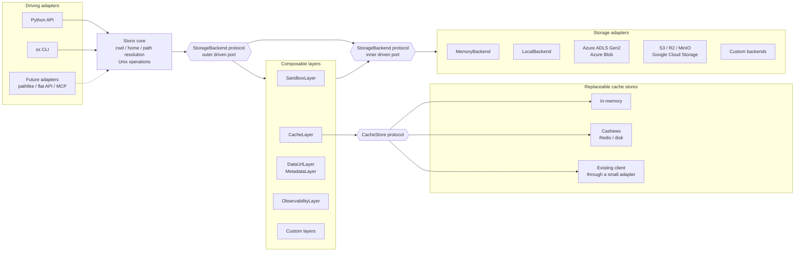

# One Stream, Three Backends: Streaming FFmpeg to Local, Azure, and R2 with Python

*Why Storix uses native Python streams, provider-agnostic storage sessions, and composable layers instead of provider-specific upload code.*

A process is already producing data.

It might be FFmpeg generating media, a compressor writing an archive, an HTTP request delivering an upload, a database exporting records, or an inference pipeline producing artifacts.

The storage destination should not determine how that producer works.

A common workflow looks like this:

```text
producer
-> write a temporary file
-> reopen the file
-> upload it through a provider-specific SDK
-> delete the temporary file
```

That works, but it spreads storage concerns into the producer and creates an intermediate file that may not need to exist.

I wanted the flow to look like this instead:

```text
producer
-> Iterable[bytes] or AsyncIterable[bytes]
-> Storix
-> configured storage backend
```

In this demo, FFmpeg generates a fragmented MP4 through stdout. Python exposes that output as an `AsyncIterator[bytes]`, and Storix writes the same stream to:

- A local directory
- Azure Blob Storage
- Cloudflare R2 through its S3-compatible API

The Python code and logical destination path stay the same. Only the storage configuration changes.

<figure class="storix-demo">
  <video
    controls
    playsinline
    preload="metadata"
    poster="https://media.mghalix.com/storix/one-stream-three-backends-poster.webp"
    aria-label="Storix streaming FFmpeg output to local storage, Azure Blob Storage, and Cloudflare R2"
  >
    <source
      src="https://media.mghalix.com/storix/one-stream-three-backends.mp4"
      type="video/mp4"
    >

    Your browser does not support embedded video.
    <a href="https://media.mghalix.com/storix/one-stream-three-backends.mp4">
      Open the demo video.
    </a>
  </video>

  <figcaption>
    FFmpeg stdout streamed to local storage, Azure Blob Storage, and
    Cloudflare R2. Only <code>STORIX_PROVIDER</code> changes.
  </figcaption>
</figure>

<!--  [Watch on YouTube](https://youtu.be/l9SpFWYtRR8) -->
[:fontawesome-brands-youtube: Watch on YouTube](https://youtu.be/l9SpFWYtRR8)

> The demo uses three destinations to keep the sequence short and readable. Storix also supports Azure Data Lake Gen2, Amazon S3 and compatible stores such as MinIO, and Google Cloud Storage.

## The core write

This is the part of the demo that matters:

```python
# Same code.
# The provider comes from STORIX_PROVIDER.
async with session as fs:
    await fs.mkdir("/launch", parents=True)
    await fs.echo(
        ffmpeg_stream(),
        "/launch/one-stream-three-backends.mp4",
        chunk_size=4 * 1024 * 1024,
    )
```

There is no Azure SDK, S3 SDK, or local filesystem branch in the application logic.

There is also no application-managed temporary video file.

FFmpeg produces chunks. Storix consumes them.

## A producer should just be Python

Developer experience is one of the main reasons I built Storix around native Python types.

You should not have to convert your data into a library-specific upload object before it can be stored.

`echo()` accepts the values Python developers already work with:

- Text and binary values such as `str`, `bytes`, `bytearray`, and other buffer-compatible objects
- Open text or binary streams such as `IO[str]` and `IO[bytes]`, including regular `open(...)` file objects
- `Iterable[str | Buffer]` and `Iterable[bytes | Buffer]`
- `AsyncIterable[str | Buffer]` and `AsyncIterable[bytes | Buffer]` through `storix.aio`

The public contract is built from standard Python `IO`, `Iterable`, `AsyncIterable`, and buffer-protocol types rather than a Storix-specific stream class.

The FFmpeg producer is therefore an ordinary async generator:

```python
import asyncio

from collections.abc import AsyncIterator


async def ffmpeg_stream() -> AsyncIterator[bytes]:
    process = await asyncio.create_subprocess_exec(
        *command,
        stdout=asyncio.subprocess.PIPE,
        stderr=asyncio.subprocess.PIPE,
    )

    assert process.stdout is not None

    while chunk := await process.stdout.read(64 * 1024):
        yield chunk
```

Nothing in this function knows that Storix exists.

It could feed those chunks into an HTTP response, a message broker, a hashing pipeline, a parser, or any other consumer that accepts an async iterable.

Storix is only the destination.

That separation makes pipelines easier to compose because their boundaries use standard language types instead of framework-specific containers.

See the [`echo()` reference](https://storix.mghalix.com/reference/storix/#echo) for the complete input contract.

## Regular Python file objects work too

Not every workflow begins with a subprocess.

A regular file opened through Python can be passed directly:

```python
from storix.aio import get_storage


async with get_storage("local", base="./data") as fs:
    with open("report.parquet", "rb") as source:
        await fs.echo(source, "/reports/report.parquet")
```

Text files work the same way:

```python
async with get_storage() as fs:
    with open("events.ndjson", encoding="utf-8") as source:
        await fs.echo(source, "/events/events.ndjson")
```

You can also produce chunks yourself:

```python
from collections.abc import AsyncIterator


async def generate_export() -> AsyncIterator[bytes]:
    async for row in database_rows():
        yield encode_row(row)


async with get_storage() as fs:
    await fs.echo(
        generate_export(),
        "/exports/customers.ndjson",
    )
```

The storage API does not force the producer to become storage-aware.

## Streaming works in both directions

Writing is only half of the flow.

Storix can also read files incrementally with `stream()`.

The synchronous API produces a regular iterator:

```python
from storix import get_storage


with get_storage("local", base="./data") as fs:
    for chunk in fs.stream("/videos/source.mp4"):
        downstream.send(chunk)
```

The asynchronous API produces an async iterator:

```python
from storix.aio import get_storage


async with get_storage() as fs:
    async for chunk in fs.stream(
        "/videos/source.mp4",
        chunk_size=64 * 1024,
    ):
        await downstream.send(chunk)
```

The downstream consumer might be:

- An HTTP response
- A decompressor
- A parser
- A media processor
- A hashing or encryption pipeline
- Another storage destination
- A machine-learning inference component

For small, known-size files, `cat()` returns the complete contents as `bytes`.

For larger workloads, `stream()` lets the application process data incrementally instead of materializing the complete object first.

Both directions use ordinary Python iteration:

```text
Python producer
-> echo()
-> storage

storage
-> stream()
-> Python consumer
```

The [`stream()` reference](https://storix.mghalix.com/reference/storix/#stream) documents the read side, including backend-selected chunk sizes and bounded-memory behavior for streaming-native backends.

## Provider selection belongs in configuration

The demo uses `get_storage()` without naming a provider in the Python code:

```python
from storix.aio import get_storage


async with get_storage() as fs:
    ...
```

Storix reads the selected provider from the environment:

```bash
STORIX_PROVIDER=local uv run python demo.py
STORIX_PROVIDER=azure uv run python demo.py
STORIX_PROVIDER=s3 uv run python demo.py
```

Provider-specific settings remain namespaced.

For Azure:

```dotenv
STORIX_PROVIDER=azure
STORIX_AZURE_CONTAINER=storix-demo
STORIX_AZURE_ACCOUNT_NAME=my-account
STORIX_AZURE_CREDENTIAL=...

# Optional:
# Omit this setting to auto-detect Blob Storage versus ADLS Gen2.
# Set it explicitly to "blob" or "adls" to skip detection.
STORIX_AZURE_KIND=blob
```

The default Azure kind is `auto`. Storix checks whether the account has hierarchical namespaces enabled and selects either the ADLS Gen2 backend or the Blob backend. Explicit `blob` or `adls` selection is useful when account-level detection is unavailable or when the required surface is already known.

For Cloudflare R2:

```dotenv
STORIX_PROVIDER=s3
STORIX_S3_BUCKET=storix-demo
STORIX_S3_REGION=auto
STORIX_S3_ENDPOINT=https://<account-id>.r2.cloudflarestorage.com
STORIX_S3_ACCESS_KEY_ID=...
STORIX_S3_SECRET_ACCESS_KEY=...
```

R2 uses Storix's S3 backend because it exposes an S3-compatible API. Cloudflare's official SDK example uses `region_name="auto"` and notes that the value is required by the AWS SDK but is not used by R2.

See:

- [Configure Storix from settings](https://storix.mghalix.com/recipes/settings/)
- [Storix backends](https://storix.mghalix.com/guide/backends/)
- [Cloudflare R2 S3 SDK configuration](https://developers.cloudflare.com/r2/get-started/s3/#3-use-an-aws-sdk)

## Configure supported providers once, then select one

Provider credentials and deployment settings remain provider-specific, but they are configured once at the application's composition boundary.

An application can configure every provider it intends to support:

```dotenv
STORIX_AZURE_CONTAINER=raw
STORIX_AZURE_ACCOUNT_NAME=...
STORIX_AZURE_CREDENTIAL=...

STORIX_S3_BUCKET=raw
STORIX_S3_REGION=auto
STORIX_S3_ENDPOINT=...
STORIX_S3_ACCESS_KEY_ID=...
STORIX_S3_SECRET_ACCESS_KEY=...

STORIX_GCS_BUCKET=raw
STORIX_GCS_CREDENTIAL_PATH=...
```

The active provider can then be selected by deployment configuration:

```dotenv
STORIX_PROVIDER=azure
```

or explicitly in code:

```python
fs = get_storage(
    settings.storage_provider,
    **settings.provider_options,
)
```

The goal is not to pretend that an Azure account name and an R2 endpoint are the same setting.

The goal is to keep those differences at one configuration boundary so they do not spread into materialization, inference, synchronization, or data-processing logic.

## Explicit configuration is just as easy

Environment-driven configuration is useful when an application has one active provider, but it is not the only option.

Every provider can also be selected and configured explicitly:

```python
from storix.aio import get_storage


fs = get_storage(
    "azure",
    container="raw",
    account_name=settings.azure_account_name,
    credential=settings.azure_credential,
)
```

This is useful in data engineering systems that need several storage sessions at the same time.

For example, one of my common patterns separates data across raw, staging, and processed zones, often described as bronze, silver, and gold in the medallion architecture:

```python
from storix.aio import Storix, get_storage


def azure_container(name: str) -> Storix:
    return get_storage(
        "azure",
        container=name,
        account_name=settings.azure_account_name,
        credential=settings.azure_credential,
    )


raw = azure_container("raw")
staging = azure_container("staging")
processed = azure_container("processed")
```

Because `kind` is omitted, Storix auto-detects whether the Azure account should use Blob Storage or ADLS Gen2.

Those sessions can be passed explicitly into application services:

```python
class MaterializationPipeline:
    def __init__(
        self,
        *,
        raw: Storix,
        staging: Storix,
        processed: Storix,
    ) -> None:
        self.raw = raw
        self.staging = staging
        self.processed = processed
```

The sessions do not need to use the same provider:

```python
raw = get_storage(
    "azure",
    container="raw",
    account_name=settings.azure_account_name,
    credential=settings.azure_credential,
)

processed = get_storage(
    "s3",
    bucket=settings.processed_bucket,
    region=settings.s3_region,
    endpoint=settings.s3_endpoint,
)
```

Configuration remains provider-specific where it needs to be.

The operations performed by the application remain consistent.

## The same logical path across providers

The demo writes to one logical path:

```text
/launch/one-stream-three-backends.mp4
```

That path resolves to a different physical destination depending on the configured backend:

```text
Local -> file:///.../launch/one-stream-three-backends.mp4
Azure -> abfss://.../launch/one-stream-three-backends.mp4
R2    -> s3://storix-demo/launch/one-stream-three-backends.mp4
```

Application code works with one Unix-style filesystem model.

Storix handles the provider boundary underneath it.

## More than `echo()` and `stream()`

Storix is not only an upload helper, and it is more than a cloud-aware path object.

A Storix session provides a broader filesystem API across its backends:

```python
await fs.mkdir("/datasets/processed", parents=True)

paths = await fs.ls("/datasets", abs=True)

async for entry in fs.walk("/datasets/raw"):
    print(entry.path, entry.kind, entry.size)

async for entry in fs.find(
    "/datasets",
    name="*.parquet",
    kind="file",
):
    print(entry.path)

matches = [
    path
    async for path in fs.glob(
        "**/*.json",
        "/datasets",
    )
]

await fs.cp(
    "/datasets/staging/batch-42",
    "/datasets/processed",
    recursive=True,
)

size = await fs.du("/datasets/processed")
properties = await fs.stat("/datasets/processed/result.parquet")

await fs.rm(
    "/datasets/staging/batch-42",
    recursive=True,
)
```

The API includes familiar controls for:

- Listing and lazy directory scanning
- Recursive walking
- Finding entries by name and kind
- Path-style globbing
- Copying and moving
- Removing files and directory trees
- Inspecting file metadata
- Calculating apparent size
- Working with current directories and relative paths
- Creating temporary or sandboxed workspaces
- Generating provider-native URLs where supported

See the complete [Storix session reference](https://storix.mghalix.com/reference/storix/).

The goal is not to pretend that every storage provider is identical.

Providers have different native capabilities. Storix makes those differences explicit, while prebuilt layers can backfill selected capabilities and custom layers can add application-specific behavior.

## Extensibility does not stop at the provider

Storix is provider-agnostic, but I did not want extensibility to end at selecting a backend.

The same design extends into cross-cutting storage behavior:

```text
backend
-> determines where the data lives

layer
-> adds behavior around storage operations

cache store
-> determines where cached values live
```

Backends, layers, and cache stores each have small structural contracts. They can be replaced independently without changing the application-facing filesystem API.

## Portable URLs for local and cloud development

`DataUrlLayer` came from a practical computer vision and agent UI problem.

In production, a cloud object can usually be exposed through a URL that the UI can render. During local development and rapid prototyping, the same image or vision result may live on the local filesystem, where no provider-native URL capability exists.

I did not want UI events or agent messages to care which backend produced the asset.

```python
from storix.aio import DataUrlLayer, get_storage


fs = get_storage().with_layer_missing(DataUrlLayer)

result_url = await fs.url("/results/detected-person.jpg")
```

The method used to compose the layer is intentional.

`with_layer_missing()` prefers a provider-native URL implementation and adds `DataUrlLayer` only when that capability is absent:

```text
backend with native URL support
-> use the backend implementation

backend without URL support
-> add DataUrlLayer
-> return an inline data: URL
```

Using `with_layer(DataUrlLayer)` instead applies the layer unconditionally. In that case, the layer wins even when the backend could have generated a native provider URL.

If a caller explicitly always wants an inline representation, `fs.data_url(path)` is also available directly on the session.

The same native-preference behavior is available as a functional combinator when layers need to be assembled before constructing the filesystem:

```python
import functools

from storix.aio import (
    CacheLayer,
    DataUrlLayer,
    InMemoryCacheStore,
    MetadataLayer,
    SandboxLayer,
    when_missing,
)


@staticmethod
def _build_layers(
    cfg: StorageLayerConfiguration,
) -> tuple[BoundLayer, ...]:
    serializer = get_serializer()

    layers: list[BoundLayer] = [
        when_missing(
            MetadataLayer,
            serialize=serializer.dumpb,
            deserialize=serializer.loads,
        ),
        when_missing(DataUrlLayer),
    ]

    if (root := cfg.sandbox) is not None:
        layers.append(
            functools.partial(
                SandboxLayer,
                root=root,
            )
        )

    if cfg.cache.enabled:
        content_store = InMemoryCacheStore(
            maxsize=CONTENT_CACHE_MAX_ENTRIES,
        )
        layers.append(
            functools.partial(
                CacheLayer,
                **cfg.cache.as_layer_kwargs(
                    content_store=content_store,
                ),
            )
        )

    return tuple(layers)
```

This is useful when the storage stack is produced by application configuration or dependency injection rather than built fluently at one call site.

`DataUrlLayer` is only one possible backfill strategy.

Data URLs work especially well for small images rendered directly by a browser UI, but they inline the complete asset as base64. That is undesirable when a URL is passed through an LLM context because it consumes a large number of tokens, and it is unsuitable for larger media.

A workflow focused on images could instead provide a custom URL layer that publishes local results through an image hosting service or, preferably, an application-owned media gateway. Another implementation could use temporary application endpoints or a dedicated media service supporting images, audio, and video.

```text
small local UI asset
-> DataUrlLayer
-> inline data: URL

image sent through an LLM workflow
-> custom hosted-image layer
-> compact HTTPS URL

general media workflow
-> application media gateway
-> temporary HTTPS URL
```

The application still calls:

```python
url = await fs.url(path)
```

Only the portable capability strategy changes.

## Portable metadata for inference datasets

`MetadataLayer` came from another computer vision workflow.

Some cloud vision APIs required each training or inference image to remain associated with identifiers such as:

```text
person_directory_id
person_id
```

Cloud object stores could preserve that information as object metadata.

Local storage could not.

Without a portable metadata layer, switching the same knowledge-base images to local storage for development would require a separate database, filename conventions, or provider checks throughout the pipeline.

The simplest construction uses Storix's built-in standard-library JSON codec:

```python
from storix.aio import MetadataLayer, get_storage


fs = get_storage().with_layer_missing(MetadataLayer)
```

Serialization is customizable when the application already has a faster or domain-specific byte serializer:

```python
serializer = get_serializer()

fs = get_storage().with_layer_missing(
    MetadataLayer,
    serialize=serializer.dumpb,
    deserialize=serializer.loads,
)
```

The callbacks are optional. Applications can substitute `orjson.dumps` and `orjson.loads`, a Pydantic-aware serializer, or another object-to-bytes codec. The serializer must return bytes rather than the string returned by `json.dumps`.

When the backend supports custom metadata natively, `with_layer_missing()` leaves it unchanged. When it does not, `MetadataLayer` preserves the metadata through a hidden sidecar stored with the data.

As with URLs, using `with_layer(MetadataLayer)` deliberately forces the sidecar implementation even over a backend with native metadata.

The inference pipeline continues to read the same metadata through Storix regardless of where the sample is stored.

See [Layers](https://storix.mghalix.com/guide/layers/) for capability-aware composition and the built-in layer stack.

## A provider-agnostic cache with provider-agnostic storage

The same extensibility applies to caching.

`CacheLayer` is not tied to Azure, S3, local storage, or any particular cache technology. It wraps the storage port, so the same caching policy can operate over every backend.

Its cache store is also replaceable.

Storix ships an in-memory store, while the `CacheStore` protocol requires only four operations:

```python
get(key, default=None)
set(key, value, *, expire=None)
delete(key)
delete_match(pattern)
```

For async Storix, a Cashews cache already satisfies that protocol directly. It can be configured with memory, disk, local Redis, or managed Redis. An existing cache library with different method names can be supported through a small adapter.

The cache technology is therefore independent from the storage technology:

```text
Azure storage + in-memory cache
Azure storage + Redis cache
S3 storage + disk cache
local storage + Redis cache
custom backend + custom cache store
```

The policy is fine-grained as well. Metadata, directory sizes, URLs, and file contents can each have different TTLs, stores, and limits:

```python
from storix.aio import CacheLayer, cache, get_storage


fs = get_storage("azure").with_layer(
    CacheLayer,
    store=stores[settings.default_store],
    ttl=settings.default_ttl,
    environment=settings.environment,
    metadata=cache(
        ttl=settings.metadata_ttl,
    ),
    du=cache(
        ttl=settings.du_ttl,
    ),
    url=cache(
        ttl=settings.url_ttl,
    ),
    read=(
        cache(
            ttl=settings.read_ttl,
            max_bytes=settings.read_max_bytes,
            store=stores[settings.read_store],
        )
        if settings.read_enabled
        else False
    ),
)
```

This configuration can:

- Cache metadata in shared Redis
- Cache content in a bounded local or disk store
- Give expensive recursive `du()` calls their own TTL
- Cache generated URLs separately
- Refuse to cache file contents larger than `max_bytes`
- Namespace entries by deployment environment
- Disable any operation independently

Each operation accepts `True`, `False`, or a `cache(...)` specification. A specification can override the default store, TTL, and, for content reads, the maximum cacheable object size.

This is an important part of the design philosophy:

> Storix does not stop at making the filesystem provider-agnostic. Its optional behavior is built around the same replaceable, protocol-driven boundaries.

See [Caching with Redis or disk](https://storix.mghalix.com/recipes/caching/#cashews-with-async-storix) for Cashews, Redis, disk caching, and adapting an existing cache client.

## Custom behavior without forking Storix

The same ports support extensions outside the built-in components.

A custom backend implements the `StorageBackend` contract. The Storix core continues to own path resolution, current-directory behavior, Unix operations, and layer composition.

As a result, the CLI, session API, and existing layers can work over the new backend without being rewritten.

A custom layer implements the same storage port, wraps an inner backend, and overrides only the operations it needs to change. `LayerBase` delegates everything else, so the layer remains portable across local storage, memory, Azure, object stores, and custom providers.

Examples include:

- Audit events
- Content validation
- Encryption
- Tracing
- Notifications
- Organization-specific authorization
- Domain-specific metadata
- Custom resilience policies

See:

- [Write a custom backend](https://storix.mghalix.com/recipes/custom-backend/)
- [Write a custom layer](https://storix.mghalix.com/recipes/custom-layer/)

## Architecture built to grow

The architecture follows ports and adapters at more than one boundary.

The Python API and `sx` CLI present the core to users. The `StorageBackend` port isolates storage implementations. Layers implement that same port and can wrap any provider. `CacheLayer` introduces another small port for replaceable cache stores.



This separation lets Storix add providers, middleware, cache technologies, and user-facing adapters without moving all of those concerns into one monolithic abstraction.

## Designed for the path from prototype to production

Storix did not begin only as a theoretical abstraction, nor only after a system was already in production.

It also came from wanting one workflow to survive the entire development lifecycle:

```text
fast isolated test
-> local prototype
-> proof of concept
-> MVP
-> production cloud deployment
```

During early development, I can use `MemoryBackend` when I need isolated execution with no external storage I/O:

```python
fs = get_storage("memory")
```

When I want files I can inspect directly, I can switch to local storage:

```python
fs = get_storage(
    "local",
    base="./development-data",
)
```

Later, the cloud infrastructure team may choose Azure, S3, GCS, or an S3-compatible service.

The shared pipeline operations should not need to change because that decision was made later:

```python
fs = get_storage()
```

```dotenv
STORIX_PROVIDER=azure
```

This makes it possible to prototype and test before the final production provider is known while still designing against the same interface that will be deployed.

The provider-specific configuration appears at the composition boundary. It does not spread through the processing code.

Storix was then shaped further by production systems and customer deployments where those same patterns had to operate over real data volumes, concurrent workloads, cloud services, and constrained machines.

## Computer vision inference and multimedia knowledge bases

Computer vision systems need to manage more than model inputs and numeric outputs.

They may handle:

- Source images and videos
- Extracted frames
- Generated clips
- Detection and inference artifacts
- Knowledge-base documents
- Knowledge-base media such as reference images and videos
- Person-directory and identity metadata
- Indexed or enriched representations

In my own workflows, knowledge-base samples included images and video used by computer vision services for training and inference.

The inference pipeline should focus on processing those assets and maintaining their domain metadata. It should not contain separate storage branches for local development and cloud deployment.

The `MetadataLayer` and `DataUrlLayer` examples above came directly from this need.

## Video materialization at terabyte scale

I have used this streaming pattern to materialize more than a terabyte of YouTube videos directly into the selected storage provider.

Each video is produced as a stream of chunks and written incrementally. The workflow does not first load a complete video into application memory, and it does not require a second provider-specific upload pass.

```text
video producer
-> chunk stream
-> Storix
-> selected provider
```

This is important beyond memory usage.

In cloud-hosted web applications and serverless-style deployments, temporary files are often instance-local and ephemeral. They may disappear after a restart, be unavailable to another replica after scale-out, or compete with tightly limited temporary disk.

Removing an unnecessary intermediate-file stage therefore reduces resource pressure and avoids making pipeline correctness depend on the lifetime of one application instance.

## Scheduled audio-library synchronization

I also use the same model in a scheduled pipeline that runs daily to synchronize a large library of audio files into storage.

The workflow can be parameterized by source, category, language, checkpoint, and destination:

```python
async def synchronize_audio(
    *,
    source: AudioSource,
    destination: Storix,
    checkpoint: CheckpointStore,
) -> None:
    ...
```

The scheduled process can:

1. Discover new or changed audio files
2. Resume from its checkpoint
3. Stream each source incrementally
4. Write it into the configured storage session
5. Persist the updated checkpoint

The pipeline does not need a separate Azure version, S3 version, and local version. It is easily parameterized by the storage session.

This matters when the same synchronization logic runs across development, staging, and production environments whose infrastructure choices differ.

## Raspberry Pi and low-resource deployments

My self-hosted Raspberry Pi applications benefit from the same incremental model.

Low-resource machines, small containers, and serverless-style environments are exactly where materializing complete objects or maintaining large temporary working directories becomes most painful.

A storage abstraction should not assume that every process has large amounts of RAM or durable temporary disk.

## Highly concurrent data engineering workloads

Data engineering pipelines often process many objects concurrently across several storage zones:

```text
raw / bronze
-> staging / silver
-> processed / gold
```

In my own workloads, these operations run through many concurrent async tasks rather than one sequential transfer loop.

Each storage zone can have its own:

- Container or bucket
- Prefix
- Provider
- Credentials
- Cache policy and cache store
- Sandboxing rules
- Observability hooks

Storix sessions can be configured independently and injected into each processing component while retaining the same filesystem operations.

## Testing without cloud infrastructure

The same abstraction is useful in tests.

Production code can receive a Storix session backed by Azure, S3, or GCS, while tests receive the in-memory backend:

```python
from storix.aio import Storix
from storix.aio.backends import MemoryBackend


fs = Storix(MemoryBackend())
```

The test does not need to mock every provider SDK method.

It can exercise real filesystem behavior against a disposable in-process backend:

```python
await fs.mkdir("/input")
await fs.echo(b"payload", "/input/item.bin")

assert await fs.cat("/input/item.bin") == b"payload"
assert await fs.exists("/input/item.bin")
```

This is another benefit of basing the public API on standard Python values and filesystem operations rather than provider request objects.

## Work with the same storage from the terminal

Storix also ships `sx`, a Unix-flavored command-line interface over the same sessions, providers, layers, and typed storage behavior.

Install it as an isolated command-line tool with only the providers you need:

```bash
uv tool install "storix[cli,azure,s3]>=0.4.7,<0.5.0"
```

Or install every bundled provider:

```bash
uv tool install "storix[all]>=0.4.7,<0.5.0"
```

`sx` can execute one command:

```bash
sx -p azure tree --long --level 2
sx -p azure du -sh /knowledge-base
```

or open an interactive session:

```bash
sx -p azure
```

The interactive shell keeps its current directory and tab-completes command names and remote paths. In Storix 0.4.7, completion is context-aware: `push` and `pull` complete local or remote paths based on the active argument position.

Transfers stream files or complete directory trees between the host and the configured provider with progress reporting:

```bash
sx push ./media /knowledge-base/media
sx pull /knowledge-base/results ./results
```

I use `sx` for quick inspection from the project root, navigating remote storage without opening a cloud dashboard, and moving data between local and cloud storage from the terminal.

Project or personal configuration can provide a default backend, persistent layers, and aliases.

For `storix.toml`:

```toml
icons = true
provider = "azure"

# Every interactive sx session gets a read-through cache.
# Inside one live shell, repeated ls, du, tree, and path completion
# can reuse the cached remote results.
layers = [
    { name = "cache", ttl = 300 },
]

[alias]
l = "ls -l"
ll = "ls -la"
lsn = "ls -lr"
lt = "tree --level 2"
lT = "tree --long"
```

For `pyproject.toml`:

```toml
[tool.storix.cli]
icons = true
provider = "azure"
layers = [
    { name = "cache", ttl = 300 },
]

[tool.storix.cli.alias]
l = "ls -l"
ll = "ls -la"
lsn = "ls -lr"
lt = "tree --level 2"
lT = "tree --long"
```

The cache is in memory for the lifetime of the `sx` session. It is most useful while navigating repeatedly inside the interactive shell:

```console
$ sx -p azure
AzureBlobBackend / > cd /knowledge-base
AzureBlobBackend /knowledge-base > lT
AzureBlobBackend /knowledge-base > lT
```

The first traversal reaches remote storage. Repeated reads in the same session can reuse cached values until their TTL expires or `refresh` clears the cache.

Storix 0.4.7 also added the full eza icon catalog, richer `ls -l` output, aliases, recursive `push` and `pull`, context-aware shell completion, and monotonic progress across multi-file transfers.

See:

- [The `sx` CLI](https://storix.mghalix.com/guide/cli/)
- [Transfers with progress](https://storix.mghalix.com/guide/cli/#transfers-with-progress)
- [CLI configuration](https://storix.mghalix.com/guide/cli/#configuration)
- [Storix 0.4.7 release notes](https://storix.mghalix.com/release-notes/#047-2026-07-21)

## What this demo proves

This demo demonstrates architectural portability. It is not a provider benchmark.

The elapsed times shown in the video include different networks, services, account configurations, and initialization paths. They should not be interpreted as a direct performance comparison.

Provider credentials and deployment settings remain provider-specific, but they can be defined once and selected through `STORIX_PROVIDER` or explicit application configuration as shown earlier.

Providers can expose different native capabilities. Storix reports those capabilities explicitly and can backfill selected behavior through prebuilt or custom layers when that behavior has a meaningful portable implementation.

What the demo proves is focused:

> A producer can expose ordinary Python chunks, and the same application code can stream those chunks into multiple storage systems.

## Try it

Storix is pre-1.0 and follows a documented versioning convention for its `0.x` releases:

- Patch releases contain fixes or backward-compatible features.
- Minor releases may contain breaking public API changes.

To remain on the compatible `0.4.x` release line:

```bash
uv add "storix[azure,s3]>=0.4.7,<0.5.0"
```

To reproduce the exact environment used for the FFmpeg recording:

```bash
uv add "storix[azure,s3]==0.4.6"
```

The recording was produced with 0.4.6, while the article includes the `sx` improvements released in 0.4.7.

This is Storix's documented pre-1.0 convention: patch releases are intended to be safe within the current minor line, while a minor increment is the breaking-change signal. See the [versioning policy](https://github.com/mghalix/storix/blob/main/docs/adr/0021-versioning-policy.md).

For a zero-configuration experiment, start with memory:

```python
import asyncio

from storix.aio import get_storage


async def main() -> None:
    async with get_storage("memory") as fs:
        await fs.mkdir("/reports")
        await fs.echo(
            b"quarterly numbers",
            "/reports/q1.txt",
        )

        print(await fs.cat("/reports/q1.txt"))
        print(await fs.ls("/reports"))


asyncio.run(main())
```

Then switch to local storage:

```python
fs = get_storage(
    "local",
    base="./storix-data",
)
```

Or select a cloud provider through configuration without rewriting the operations around it.

## What workflow are you building?

Storix is still pre-1.0, and real workflows are the most valuable input into its direction.

I am especially interested in cases where:

- A producer already emits chunks
- Large objects make full materialization impractical
- Development and production use different storage providers
- Several storage zones are active in one application
- Provider-specific SDK code has spread into business logic
- Repeated remote operations would benefit from caching
- A provider capability gap prevents a clean workflow
- Custom storage middleware would simplify the application

Share the producer, destination, approximate data volume, and what feels awkward today in the [Storix Discussions](https://github.com/mghalix/storix/discussions).

The goal is not to invent abstractions in isolation.

It is to make real storage workflows feel like Python.

```text
One stream.
Three backends.
Zero storage rewrites.
```

## Continue exploring

- [Storix documentation](https://storix.mghalix.com/)
- [GitHub repository](https://github.com/mghalix/storix)
- [Storix 0.4.7 release notes](https://storix.mghalix.com/release-notes/#047-2026-07-21)
- [Reading and writing](https://storix.mghalix.com/guide/reading-and-writing/)
- [Configure from settings](https://storix.mghalix.com/recipes/settings/)
- [Layers and composition](https://storix.mghalix.com/guide/layers/)
- [Caching with Redis or disk](https://storix.mghalix.com/recipes/caching/#cashews-with-async-storix)
- [Write a custom backend](https://storix.mghalix.com/recipes/custom-backend/)
- [Write a custom layer](https://storix.mghalix.com/recipes/custom-layer/)
- [The `sx` CLI](https://storix.mghalix.com/guide/cli/)
- [Cloudflare R2 S3 SDK configuration](https://developers.cloudflare.com/r2/get-started/s3/#3-use-an-aws-sdk)
